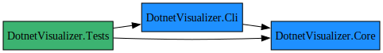

<!-- README for dotviz -->
<!-- SPDX-License-Identifier: MIT -->

<h1 align="center">dotviz</h1>
<p align="center">
  <em>Graphviz &amp; Mermaid diagrams for your .NET projects.</em>
</p>

<div align="center">
  
</div>

---

## Features

| Feature | dotviz |
|---------|--------|
| **Project graphs** | Visualise `*.sln` / `*.csproj` dependencies. |
| **NuGet / transitive** | Add direct or all package references. |
| **DI trees** | Renders `IServiceCollection` dependency tree. |
| **Graph engines** | **Graphviz DOT** *(default)* & **Mermaid flowchart** (`--mermaid`). |
| **Global .NET tool** | `dotnet tool install -g dotviz`. |

---

## Quick start

```bash
# install (global tool)
dotnet tool install -g dotviz

# project & NuGet graph
dotviz MySolution.sln --packages --edge-label --self-ref highlight

# Draw Mermaid instead of DOT
dotviz src/MyApp/MyApp.csproj --mermaid > graph.mmd
```

## SVG output requires Graphviz `dot`

| OS      | Command                                         |
| ------- | ----------------------------------------------- |
| Windows | `choco install graphviz`                        |
| macOS   | `brew install graphviz`                         |
| Linux   | `apt install graphviz` / `dnf install graphviz` |


## Usage

```bash
dotviz <input> [options]

  <input>                .sln / .csproj file(s) or --folder <dir>

Options

  --folder               Scan folder recursively for *.csproj
  -o, --output           Output .dot (defaults to <input>.dot)
  --packages             (Default: false) Include NuGet packages
  --svg                  (Default: false) Render SVG via Graphviz
  --package-scope        (Default: direct) direct (only <PackageReference/>) |
                         all (transitive) . Ignored if --packages is false.
  --edge-label           (Default: false) Write 'PackageReference' or
                         'Reference' labels on edges.
  --exclude              Comma-separated substrings. Matching projects or
                         packages are omitted from the graph.
  --collapse-matching    Collapse a NuGet package when its name matches a
                         project name; draw a special coloured project =>
                         project edge instead.
  --self-ref             (Default: Hide) Hide | Show | Highlight
  --per-project          With --folder: emit one graph per each .csproj in that
                         folder.
  --mermaid              (Default: false) Generate a Mermaid .mmd file instead
                         of / in addition to DOT
  --help                 Display the help screen.
  --version              Display version information.
  value pos. 0           One or more .sln / .csproj paths. If omitted, --folder
                         must be supplied.

```

## DI visualisation (library API)

```csharp
services
    .DumpDependencyGraphAsync("services.dot", svg: false, "Microsoft.Extensions.*");
```

| Lifetime  | Colour                                                                     | Shape |
| --------- | -------------------------------------------------------------------------- | ----- |
| Singleton | LightGreen | Box   |
| Scoped    | Gold                                                                       | Box   |
| Transient | LightPink                                                                  | Box   |
